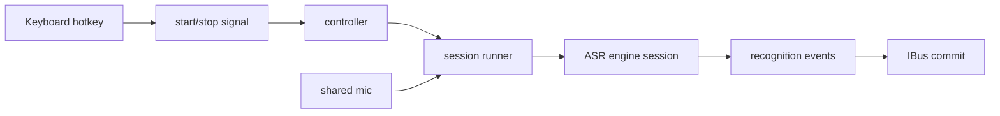

# Signal Driven Control Design

## Goal
- Hotkey handling only emits control signals.
- A single controller consumes those signals and drives the whole ASR lifecycle.
- The ASR engine still only handles recognition text.
- IBus still only handles commit.

## Non-Goals
- No change to the Doubao protocol itself.
- No file-based recognition fallback.
- No UI redesign.

## Inputs
- Hotkey events from `/dev/input/event*`.
- Audio frames from the shared mic source.
- Recognition events from the engine session.
- IBus commit results.

## Outputs
- Control events: `start`, `stop`, `shutdown`.
- Recognition text events: `interim`, `final`, `error`, `vad`, `session_finished`.
- IBus commit logs: success or failure.

## Constraints
- One hotkey press must never start more than one session.
- One hotkey release must only stop the current session.
- The mic must remain warm across sessions.
- The first session should not pay cold-start cost.
- The controller must stay single-threaded in behavior even if mic and engine are async.

## Proposed Architecture

### 1. Hotkey source
- Listens to keyboard events.
- Emits only control signals.
- Does not create sessions.
- Does not mute or unmute.
- Does not talk to IBus.

### 2. Control controller
- Owns session state.
- Receives `start` and `stop`.
- Creates a session on `start`.
- Stops the active session on `stop`.
- Rejects duplicate `start` while a session is active.
- Ignores `stop` when there is no active session.

### 3. Session runner
- Consumes a started session and the shared mic stream.
- Sends audio to the engine.
- Consumes recognition events.
- Commits `final` text to IBus immediately.
- Handles session cleanup.

### 4. Shared mic
- Starts once.
- Stays alive across sessions.
- Keeps a short pre-roll buffer.
- New sessions read buffered audio first, then live audio.

## Data Flow

## Error Handling
- If mic startup fails, emit one init error and do not open sessions.
- If engine start fails, do not mute, do not commit, return to idle.
- If `final` commit fails, log the failure and continue session cleanup.
- If `stop` arrives before `start`, ignore it.
- If duplicate `start` arrives while active, ignore it.

## Testing
- Controller rejects duplicate start.
- Controller ignores stop when idle.
- Shared mic stays alive across multiple sessions.
- First session can consume pre-roll audio.
- `final` still triggers IBus commit immediately.
- Session cleanup still un-mutes after stop.

## Rollback
- Keep the current direct hotkey-to-session path behind a small adapter.
- If the signal controller regresses, revert only the controller wiring.
- Do not roll back engine or IBus changes.

## Acceptance Criteria
- Hotkey layer emits only signals.
- A single controller drives session start and stop.
- Mic stays warm across sessions.
- `final` still commits immediately.
- Existing IBus commit and debug behavior remain intact.
