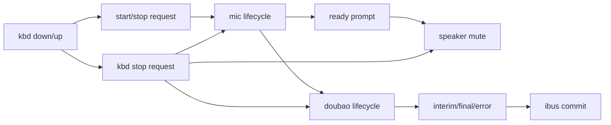

# Lifecycle Constraints Design

## Goal
- Make every runtime object own a clear lifecycle.
- Drive lifecycle transitions by hotkey signals and data flow separately.
- Keep each responsibility single-purpose and non-blocking.

## Non-Goals
- No ASR protocol redesign.
- No UI redesign.
- No change to recognition text content.
- No change to IBus protocol semantics.

## Inputs
- Hotkey signals: `down` and `up`.
- Mic readiness and audio chunks.
- Recognition events from the engine.
- IBus commit outcomes.

## Outputs
- Lifecycle actions: start, stop, open, ready, close, mute, unmute.
- Recognition events: `interim`, `final`, `error`, `session_finished`.
- IBus commit result: success or failure.
- Signal prompt sound that means "microphone is ready".

## Constraints
- `kbd` only emits lifecycle requests.
- `kbd` must not wait on mic, engine, or IBus.
- `mic` owns capture lifecycle and audio delivery.
- `speaker` owns mute/unmute and the ready prompt sound.
- `doubao` owns recognition lifecycle and text events.
- `ibus` owns final text commit only.
- Every layer must remain asynchronous.
- A slow downstream layer must not block the hotkey path.

## Lifecycle Rules
- `kbd down` requests start.
- `mic open` happens first.
- `mic ready` means audio can be captured and forwarded.
- Ready prompt plays after `mic ready`.
- Ready prompt is only a signal, not a control gate.
- `speaker mute` happens as part of entering the active session.
- `doubao` starts from mic audio, not from the key itself.
- `final` text triggers IBus commit.
- `kbd up` requests stop.
- `mic close` and `doubao finish` happen during shutdown.
- `speaker unmute` happens after session teardown.

## Responsibilities

### Keyboard
- Emits start and stop requests.
- Does not own session state.
- Does not talk to mic, speaker, doubao, or IBus directly.

### Mic
- Opens and closes capture.
- Reports readiness.
- Streams audio chunks to the engine.
- Does not commit text.

### Speaker
- Mutes when the session becomes active.
- Plays the ready prompt after mic readiness.
- Unmutes on teardown.
- Does not decide whether recognition starts.

### Doubao
- Starts from audio input.
- Emits interim and final recognition events.
- Ends when the session shuts down.
- Does not own keyboard state.

### IBus
- Receives only final text.
- Commits only after `final`.
- Does not participate in audio capture.

## Data Flow

## Error Handling
- If mic open fails, stop the lifecycle and surface one init error.
- If mic ready never arrives, do not block the hotkey path forever.
- If recognition fails before `final`, do not commit IBus.
- If IBus commit times out, surface the commit failure and continue teardown.
- If `kbd up` arrives early, stop capture and let the current session settle.

## Verification
- `bun test src/runtime/session-state.test.ts src/runtime/session-runner.test.ts src/runtime/session-runner-final.test.ts src/runtime/output.test.ts`
- `timeout 5s bun index.ts --debug`
- Confirm the ready prompt appears after mic readiness.
- Confirm final text is the only input to IBus commit.

## Acceptance Criteria
- Each runtime object has a clear lifecycle boundary.
- The ready prompt only signals mic availability.
- Hotkey handling stays non-blocking.
- Audio capture, recognition, speaker mute, and IBus commit do not share a single mixed responsibility.
- Final recognition still commits to IBus.
